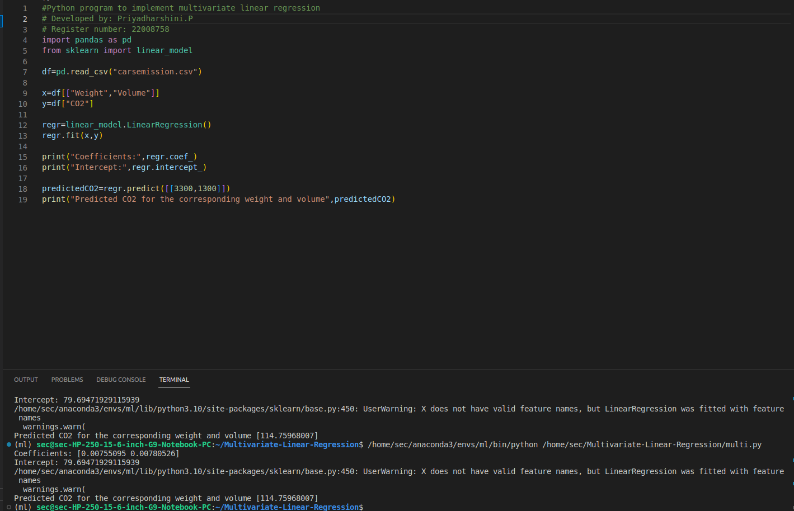

# Implementation of Multivariate Linear Regression:
## Aim:
To write a python program to implement multivariate linear regression and predict the output.
## Equipment’s required:
1.	Hardware – PCs
2.	Anaconda – Python 3.7 Installation / Moodle-Code Runner
## Algorithm:
### Step 1:
Import pandas as pd.

### Step 2:
Read the csv file.

### Step 3:
Get the value of X and y variables.

### Step 4:
Create the linear regression model and fit.

### Step 5:
Predict the CO2 emission of a car where the weight is 2300kg, and the volume is 1300cm3.

### Step 6:
Print the predicted output.

## Program:
```python
#Python program to implement multivariate linear regression
#Developed by: Priyadharshini.P
#Register number: 22008758
import pandas as pd
from sklearn import linear_model

df=pd.read_csv("carsemission.csv")

x=df[["Weight","Volume"]]
y=df["CO2"]

regr=linear_model.LinearRegression()
regr.fit(x,y)

print("Coefficients:",regr.coef_)
print("Intercept:",regr.intercept_)

predictedCO2=regr.predict([[3300,1300]])
print("Predicted CO2 for the corresponding weight and volume",predictedCO2)

```
## Output:


## Result
Thus the multivariate linear regression is implemented and predicted the output using python program.